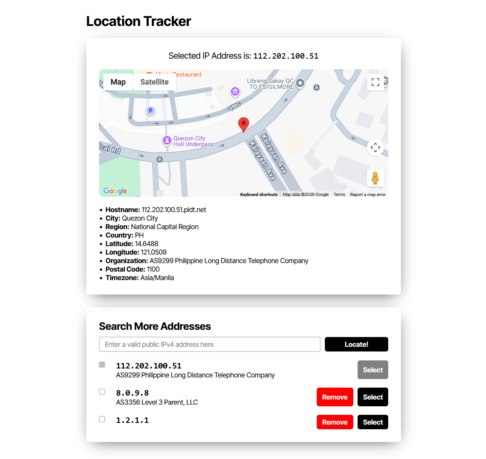

# JLabs Internship Exam

This project is a submission for JLabs by Lance Owen Gulinao.

## Folders and Tech Stack
 - `backend/` - Responsible for handling user logins. Written with Express.js, using Zod for validation and Drizzle as an ORM connected to the postgres database. Authentication is done using JWT-based email and password authentication.
 - `frontend/` - The main application. Written on React with Vite and implements core app functionality like IP Geolocation.

## Database setup

This project requires a Postgres instance to work. You can quickly spin up one using Docker or by installing it to your computer. You can create the necessary tables using the `backend/database-init.sql` file. Simply execute the SQL command on the postgres database.

## Setup
 - **Frontend setup** - enter the `frontend` directory and install the packages. Copy the `.env.example` file to `.env`. You can choose to provide a Google Maps API key on the `VITE_GOOGLE_MAPS_API_KEY` field.
 - **Backend setup** - enter the `backend` directory and install the packages. Copy the `.env.example` file to `.env`. Replace the `DATABASE_CONNECTION_STRING` field with the connection string pointing to your Postgres instance.

## Screenshots
